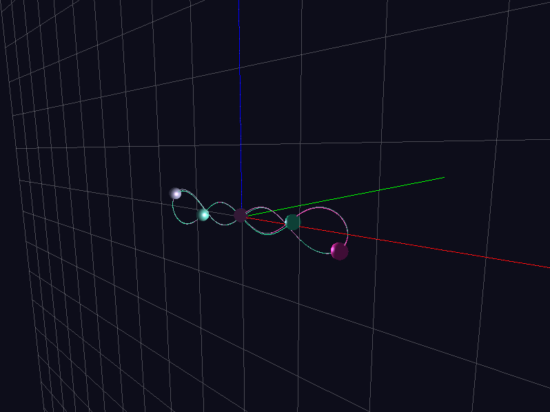
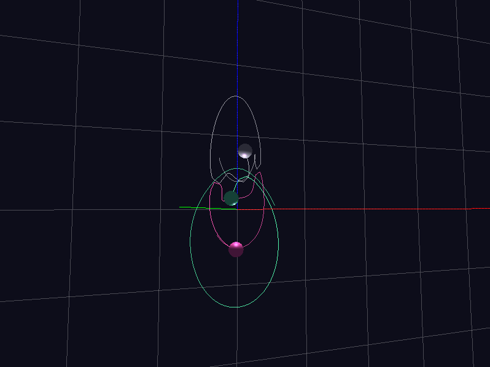

# n-body-choreographies

## Build

```sh
mkdir build
cd build
cmake ../
make
```
## Run

```sh
./build/main <method_file> <speed> [method] < <state_file>
./build/main methods/dopri5.txt 1 adams < states/chain.txt  # example
```

## Screenshots


